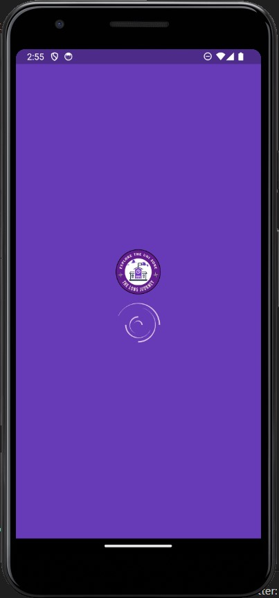
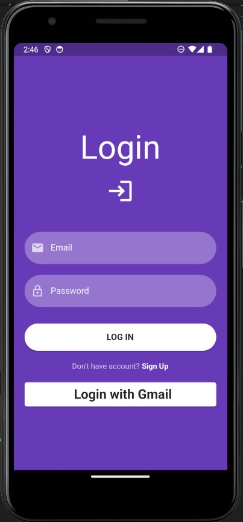
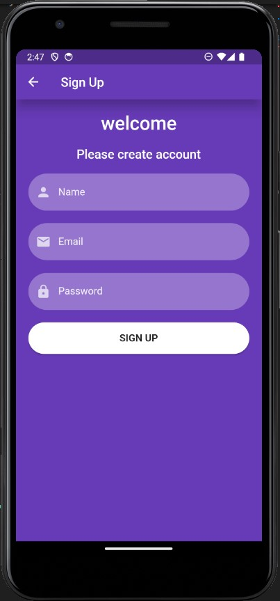
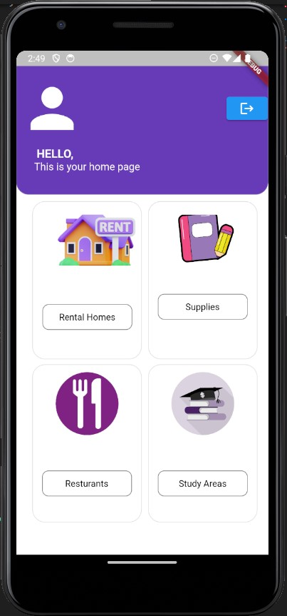
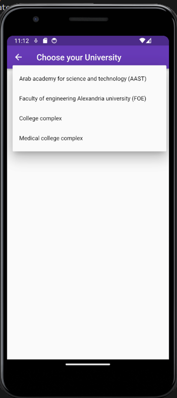
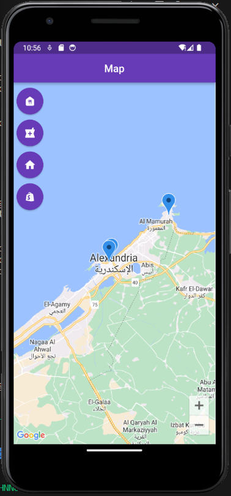
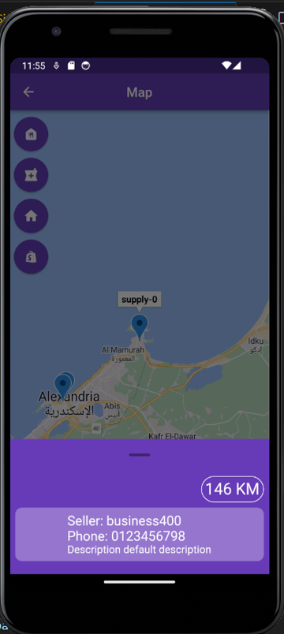

# <center >Student Compass</center>

## What does it do?

Student Compass is a full-stack flutter application. It allows the user (student) to do basic operations such as signup and login. He also can naigate to see all possible nearby appartments available for rent, places to buy university supplies, restaurants or even study areas on a map and know the distance between him and that place.

## Technologies used

[](https://skillicons.dev)

## Getting Started

### Prerequisites
- [flutter]()
- [Andriod studio]()
- [Node js](https://nodejs.org/en)
- [Node package manager (npm)](https://www.npmjs.com/)
- [Postgress](https://www.postgresql.org/)

### Demo

<div style = "display: flex; flex-wrap: wrap;">
    
    
    
    
    
    
    
</div>

### Installation

#### Below are the steps to help you install and run the project:

1. Clone the repository

```r
git clone https://github.com/MoustafaAshraf8/Student-compass.git
```

### Usage
#### Below are the steps to run the full-stack website
1. Create database in postgress (sql)

```r
# either create using pgAdmin or write this sql query in postgres shell
create database studentcompass_database;
```
2. Create .env file with these data init:

```r
//database
NODE_ENV="production"
POSTGRESS_HOST= <your desired host>
POSTGRESS_USER= <your postgres user>
POSTGRESS_PORT= 5432
POSTGRESS_PASSWORD= <your postgres user password>
POSTGRESS_DATABASE= "studentcompass_database"
//operating
PORT=80
//token
ACCESS_TOKEN_SECRET="02d87076e5db06edba9cd95c3f835d5c341f32440a295bb8af6f7821ebef24c90b3773e42e630544ad16b9f7a751c2c580282e956882ea6c26a475c64b628959"
```
3. Setup server
```r
# change directory to server
cd Server
# install packages
npm install
# run server
npm start
```

4. Setup flutter application
```r
# change directory to flutter application
cd studentcompass
# install packages
flutter pub get
# run flutter application
flutter run lib/main.dart
```